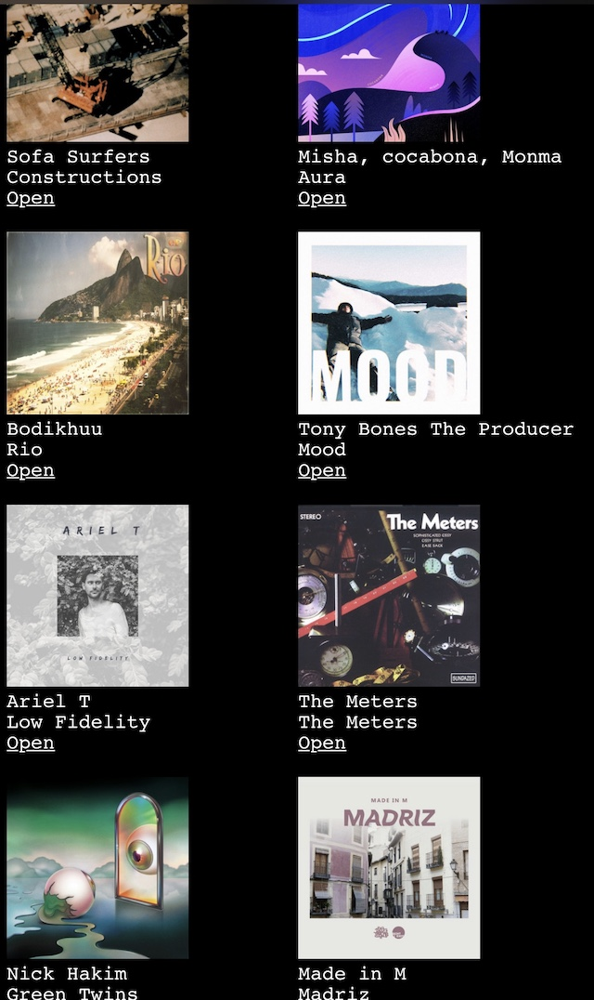

# SLS: Simple/Sane/? Library System

SLS integrates my various music libraries into a single database that is
automatically kept up to date.

Libraries currently supported:

* Spotify (via Spotify Web API)
* Vinyl (via Discogs Web API)

The main function of SLS is to provide a starting point for listening, or to
put simply, to display a random selection of albums in the library in a clean &
minimalist UI. Some things really just should be this simple... and yet this is
100% impossible to do in any streaming music app I have ever tried. Spotify in
particular does a very poor job of enabling users to browse and
"re-discover" items in their own library. Additionally, much has been written
about whether the Spotify app's shuffle function is indeed random, to me it
seems clear that it is not. (That said, there are things Spotify excels at,
such as discovery, and the streaming experience itself.)

On the physical and digital media side, while many vinyl collectors use Discogs
to catalogue their collection; and while the Discogs app does offer a "random
album" function, it still misses the mark -- I like to see 20 or so randomly
selected albums at once and a way to quickly refresh if I don't see anything I
like. Plus, it would be nice to see all libraries combined into one UI... hence
SLS.

SLS *does not* replace the use of the various apps themselves. I still use
Spotify for discovery, playback and library management itself. Similarly, I use
the Discogs app to manage my vinyl collection. But now, whenever deciding what
to listen to next, instead of being forced to use the various apps' subpar
browsing models, I start with SLS. Once I decide to play something, I click
through to the album in the Spotify app (or go play the record).

SLS runs on one of my Raspi servers. The library refresh jobs are run once
an hour via a cronjob and the libraries are stored in a Redis database (ie. if
I add an album to my library in the Spotify app, it will show up in Redis --
and SLS -- automatically within an hour). The UI itself is done via a CGI
program that is served via lighttpd.

SLS has a few more tricks up its sleeve:

* Display a random selection of all as well as of newly added albums.
* Display a random selection of all as well as of new, "albums to listen to".
  For SLS an "album to listen to" is any unsaved album that has at least one
  track favorited and that has at least three tracks.
* Automatically unset "repeat" in the player. I find it highly annoying that
  Spotify constantly re-enables the "repeat" button in the player. Perhaps this
  is what most users want and certainly this helps Spotify's streaming numbers.
  I prefer the player to stop at the end of an album though. Luckily, Spotify's
  Web API can control this setting. So I run a cronjob to unset the repeat
  setting every minute.

